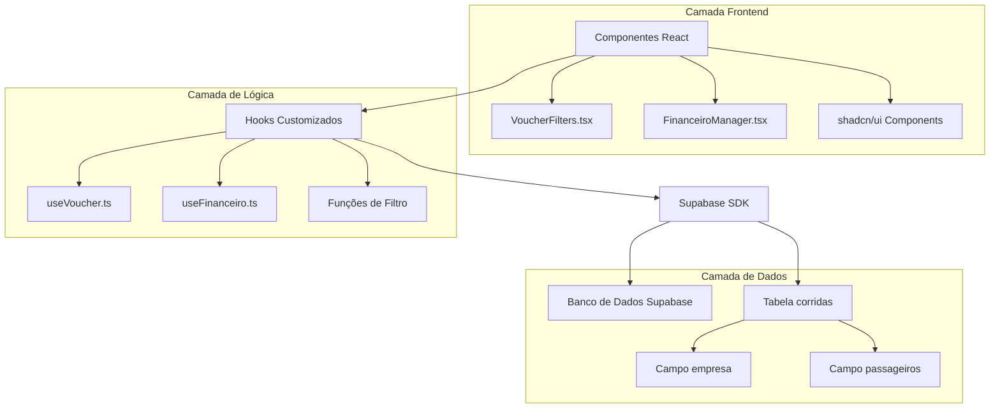
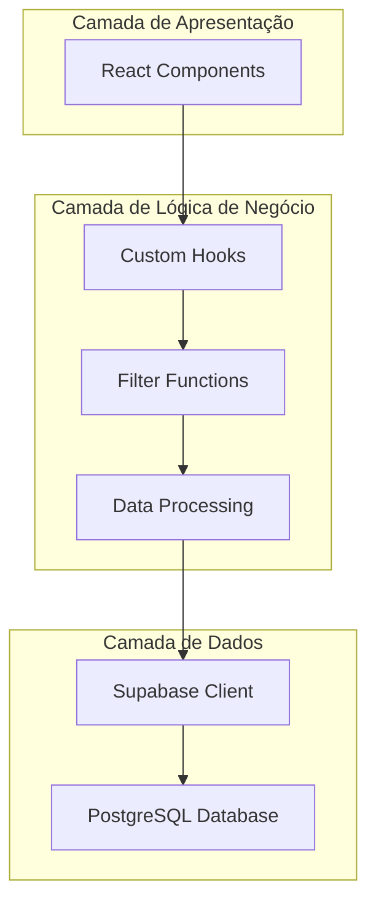
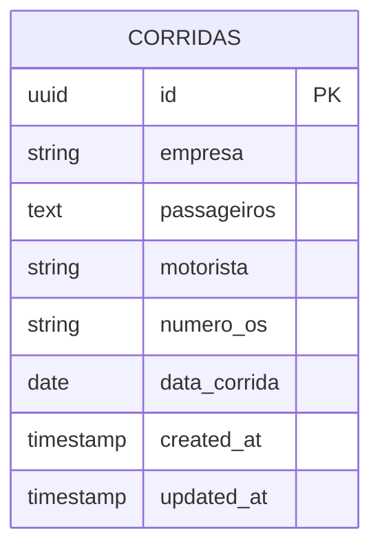

# Arquitetura Técnica - Filtros de Empresa e Passageiros

## 1. Design da Arquitetura



## 2. Descrição da Tecnologia

- **Frontend**: React@18 + TypeScript + Tailwind CSS + shadcn/ui + Vite
- **Backend**: Supabase (PostgreSQL + Auth + Real-time)
- **Componentes UI**: shadcn/ui (Select, Input, Button)
- **Ícones**: Lucide React
- **Busca**: Algoritmo fuzzy search customizado em JavaScript

## 3. Definições de Rotas

| Rota | Propósito |
|------|-----------|
| /voucher | Página de vouchers com filtros de data, empresa e passageiros |
| /financeiro | Página financeira com filtros de data, motorista, número OS, empresa e passageiros |

## 4. Definições de API

### 4.1 Hooks Customizados

**useVoucher Hook**
```typescript
interface UseVoucherReturn {
  corridas: VoucherData[];
  empresas: string[];
  filterData: (data: VoucherData[]) => VoucherData[];
  filterByEmpresa: (data: VoucherData[], empresa: string) => VoucherData[];
  filterByPassageiros: (data: VoucherData[], searchTerm: string) => VoucherData[];
}
```

**useFinanceiro Hook**
```typescript
interface UseFinanceiroReturn {
  corridas: CorridaFinanceiro[];
  empresas: string[];
  filterByEmpresa: (data: CorridaFinanceiro[], empresa: string) => CorridaFinanceiro[];
  filterByPassageiros: (data: CorridaFinanceiro[], searchTerm: string) => CorridaFinanceiro[];
  // ... outras funções existentes
}
```

### 4.2 Tipos de Dados

**Filtros de Estado**
```typescript
interface FilterState {
  selectedEmpresa: string; // 'all' ou nome da empresa
  passageirosFilter: string; // termo de busca (mín. 3 caracteres)
}
```

**Dados de Corrida**
```typescript
interface CorridaData {
  id: string;
  empresa: string;
  passageiros: string; // texto livre com nomes separados
  // ... outros campos
}
```

## 5. Arquitetura do Servidor



## 6. Modelo de Dados

### 6.1 Definição do Modelo de Dados



### 6.2 Linguagem de Definição de Dados

**Tabela corridas (existente)**
```sql
-- A tabela já existe, apenas documentando os campos relevantes
-- Campo empresa: armazena o nome da empresa
-- Campo passageiros: texto livre com nomes dos passageiros

-- Índices para otimização de busca (opcionais)
CREATE INDEX IF NOT EXISTS idx_corridas_empresa ON corridas(empresa);
CREATE INDEX IF NOT EXISTS idx_corridas_passageiros_gin ON corridas USING gin(to_tsvector('portuguese', passageiros));

-- Permissões Supabase
GRANT SELECT ON corridas TO anon;
GRANT ALL PRIVILEGES ON corridas TO authenticated;
```

**Funções de Filtro JavaScript**
```typescript
// Função para extrair empresas únicas
const getUniqueEmpresas = (corridas: CorridaData[]): string[] => {
  return [...new Set(corridas.map(c => c.empresa).filter(Boolean))].sort();
};

// Função de busca fuzzy para passageiros
const fuzzySearchPassageiros = (corridas: CorridaData[], searchTerm: string): CorridaData[] => {
  if (searchTerm.length < 3) return corridas;
  
  const searchWords = searchTerm.toLowerCase().split(' ').filter(word => word.length > 0);
  
  return corridas.filter(corrida => {
    if (!corrida.passageiros) return false;
    
    const passageirosWords = corrida.passageiros.toLowerCase().split(/[,;:\s]+/).filter(word => word.length > 0);
    
    return searchWords.some(searchWord =>
      passageirosWords.some(passageiroWord =>
        passageiroWord.includes(searchWord) || searchWord.includes(passageiroWord)
      )
    );
  });
};
```