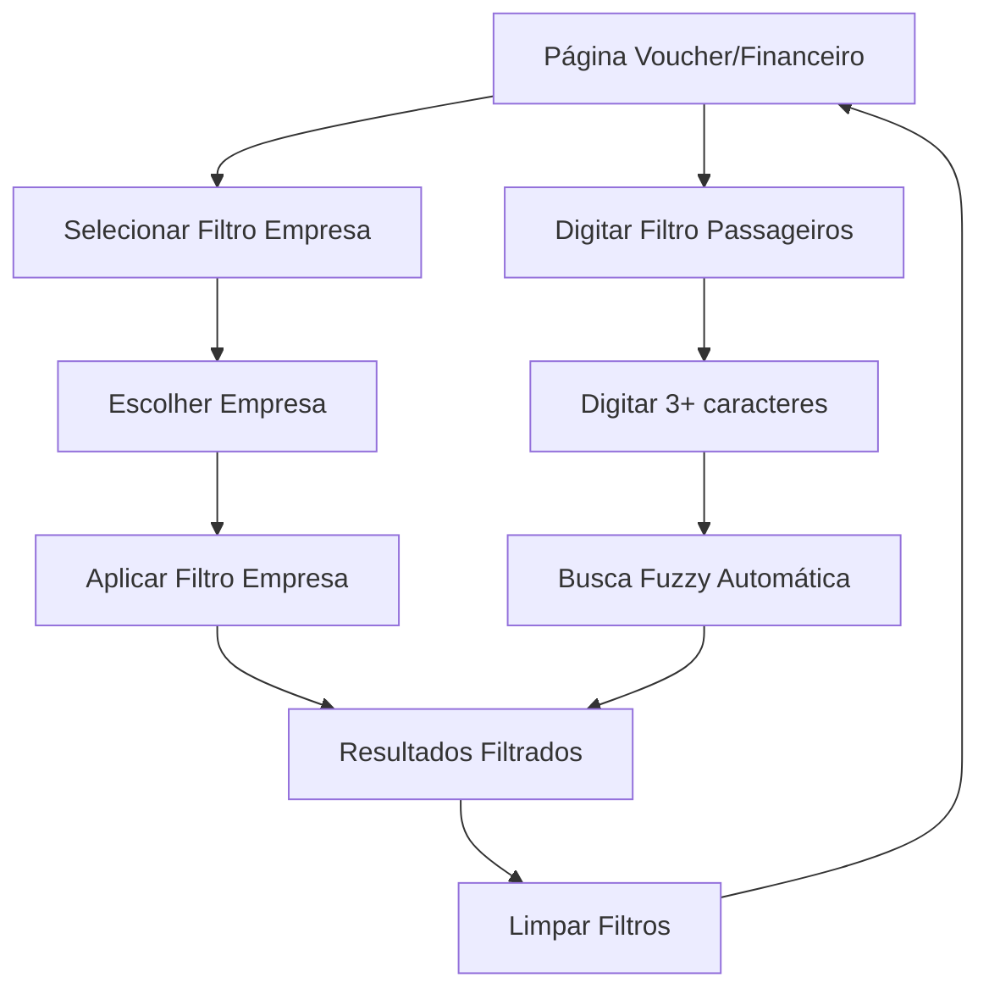

# Filtros de Empresa e Passageiros - Páginas Voucher e Financeiro

## 1. Visão Geral do Produto

Este documento especifica a implementação de dois novos filtros nas páginas Voucher e Financeiro do sistema Prime Transportes: filtro de **Empresa** e filtro de **Passageiros**. O objetivo é facilitar a busca e filtragem de corridas por empresa e por nomes de passageiros, melhorando a experiência do usuário na gestão financeira e de vouchers.

O filtro de Passageiros implementará busca inteligente com sugestões automáticas a partir de 3 caracteres digitados, permitindo localizar corridas mesmo com nomes parciais ou similares.

## 2. Funcionalidades Principais

### 2.1 Papéis de Usuário
Não há distinção de papéis específicos para esta funcionalidade. Todos os usuários autenticados que têm acesso às páginas Voucher e Financeiro poderão utilizar os novos filtros.

### 2.2 Módulo de Funcionalidades

Nossos requisitos consistem nas seguintes páginas principais:
1. **Página Voucher**: filtros de data existentes + novos filtros de empresa e passageiros
2. **Página Financeiro**: filtros existentes (data, motorista, número OS) + novos filtros de empresa e passageiros

### 2.3 Detalhes das Páginas

| Nome da Página | Nome do Módulo | Descrição da Funcionalidade |
|----------------|----------------|------------------------------|
| Voucher | Filtros de Empresa | Dropdown com lista de todas as empresas disponíveis no sistema, permitindo filtrar corridas por empresa específica |
| Voucher | Filtros de Passageiros | Campo de busca com autocomplete que pesquisa no campo texto "passageiros" das corridas, iniciando busca a partir de 3 caracteres |
| Financeiro | Filtros de Empresa | Dropdown com lista de todas as empresas disponíveis no sistema, permitindo filtrar corridas por empresa específica |
| Financeiro | Filtros de Passageiros | Campo de busca com autocomplete que pesquisa no campo texto "passageiros" das corridas, iniciando busca a partir de 3 caracteres |

## 3. Processo Principal

### Fluxo de Uso dos Filtros

**Filtro de Empresa:**
1. Usuário acessa página Voucher ou Financeiro
2. Usuário clica no dropdown "Empresa"
3. Sistema exibe lista de todas as empresas disponíveis
4. Usuário seleciona uma empresa específica ou "Todas"
5. Sistema filtra e exibe apenas corridas da empresa selecionada

**Filtro de Passageiros:**
1. Usuário acessa página Voucher ou Financeiro
2. Usuário clica no campo "Passageiros"
3. Usuário digita pelo menos 3 caracteres
4. Sistema realiza busca fuzzy no campo texto "passageiros" das corridas
5. Sistema exibe corridas que contenham palavras similares ao termo digitado
6. Usuário pode limpar o filtro para ver todas as corridas novamente

## 4. Design da Interface do Usuário

### 4.1 Estilo de Design

- **Cores primárias**: Seguir o tema existente do sistema (azul primário, cinza secundário)
- **Estilo de botões**: Componentes shadcn/ui com bordas arredondadas (rounded-md)
- **Fonte**: Inter ou system font, tamanhos text-sm para labels, text-base para inputs
- **Layout**: Design responsivo com grid/flexbox, alinhamento consistente com filtros existentes
- **Ícones**: Lucide React icons (ChevronDown para dropdown, Search para campo de busca)

### 4.2 Visão Geral do Design das Páginas

| Nome da Página | Nome do Módulo | Elementos da UI |
|----------------|----------------|-----------------|
| Voucher | Filtros de Empresa | Select dropdown com placeholder "Selecionar empresa", opção "Todas as empresas", lista scrollável de empresas |
| Voucher | Filtros de Passageiros | Input text com placeholder "Buscar passageiros (mín. 3 letras)", ícone de busca, clear button |
| Financeiro | Filtros de Empresa | Select dropdown com placeholder "Selecionar empresa", opção "Todas as empresas", lista scrollável de empresas |
| Financeiro | Filtros de Passageiros | Input text com placeholder "Buscar passageiros (mín. 3 letras)", ícone de busca, clear button |

### 4.3 Responsividade

- **Desktop-first**: Filtros dispostos horizontalmente em linha com os filtros existentes
- **Mobile-adaptive**: Em telas menores (< 768px), filtros empilham verticalmente
- **Touch optimization**: Campos de input e dropdowns com altura mínima de 44px para facilitar toque
- **Breakpoints**: sm (640px), md (768px), lg (1024px) seguindo padrões Tailwind CSS