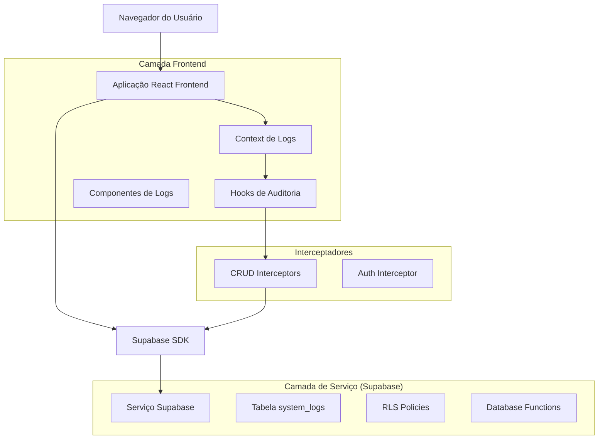
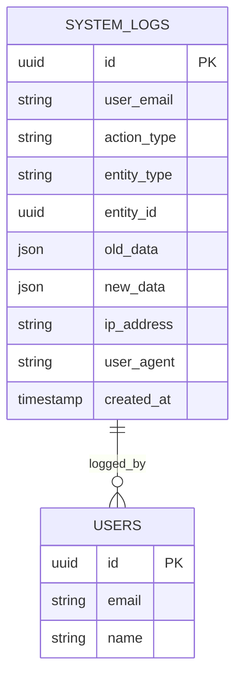

# Sistema de Logs - Arquitetura Técnica

## 1. Design da Arquitetura



## 2. Descrição das Tecnologias

* Frontend: React\@18 + TypeScript + TailwindCSS\@3 + Vite

* Backend: Supabase (PostgreSQL + Auth + RLS)

* Estado: Context API + Custom Hooks

* UI: Shadcn/ui + Lucide Icons

## 3. Definições de Rotas

| Rota           | Propósito                                             |
| -------------- | ----------------------------------------------------- |
| /logs          | Painel principal de logs do sistema (acesso restrito) |
| /logs/:id      | Detalhes específicos de uma ação de log               |
| /logs/settings | Configurações de retenção e limpeza de logs           |

## 4. Definições de API

### 4.1 APIs Principais

**Listar logs do sistema**

```
GET /rest/v1/system_logs
```

Parâmetros de Query:

| Nome do Parâmetro | Tipo   | Obrigatório | Descrição                                                        |
| ----------------- | ------ | ----------- | ---------------------------------------------------------------- |
| limit             | number | false       | Número de registros por página (padrão: 50)                      |
| offset            | number | false       | Offset para paginação                                            |
| user\_email       | string | false       | Filtrar por email do usuário                                     |
| action\_type      | string | false       | Filtrar por tipo de ação (CREATE/UPDATE/DELETE)                  |
| entity\_type      | string | false       | Filtrar por entidade (empresas/solicitantes/motoristas/corridas) |
| date\_from        | string | false       | Data inicial (ISO 8601)                                          |
| date\_to          | string | false       | Data final (ISO 8601)                                            |

Resposta:

| Nome do Parâmetro | Tipo      | Descrição                                   |
| ----------------- | --------- | ------------------------------------------- |
| id                | uuid      | ID único do log                             |
| user\_email       | string    | Email do usuário que executou a ação        |
| action\_type      | string    | Tipo da ação realizada                      |
| entity\_type      | string    | Tipo da entidade afetada                    |
| entity\_id        | uuid      | ID da entidade afetada                      |
| old\_data         | json      | Dados antes da alteração (null para CREATE) |
| new\_data         | json      | Dados após a alteração (null para DELETE)   |
| ip\_address       | string    | Endereço IP do usuário                      |
| user\_agent       | string    | User agent do navegador                     |
| created\_at       | timestamp | Timestamp da ação                           |

**Excluir logs em lote**

```
DELETE /rest/v1/system_logs
```

Request Body:

| Nome do Parâmetro | Tipo    | Obrigatório | Descrição                             |
| ----------------- | ------- | ----------- | ------------------------------------- |
| delete\_all       | boolean | false       | Excluir todos os logs                 |
| date\_before      | string  | false       | Excluir logs anteriores a esta data   |
| ids               | array   | false       | Array de IDs específicos para excluir |

## 5. Modelo de Dados

### 5.1 Definição do Modelo de Dados



### 5.2 Linguagem de Definição de Dados

**Tabela de Logs do Sistema (system\_logs)**

```sql
-- Criar tabela
CREATE TABLE system_logs (
    id UUID PRIMARY KEY DEFAULT gen_random_uuid(),
    user_email VARCHAR(255) NOT NULL,
    action_type VARCHAR(20) NOT NULL CHECK (action_type IN ('CREATE', 'UPDATE', 'DELETE')),
    entity_type VARCHAR(50) NOT NULL CHECK (entity_type IN ('empresas', 'solicitantes', 'motoristas', 'corridas')),
    entity_id UUID NOT NULL,
    old_data JSONB,
    new_data JSONB,
    ip_address INET,
    user_agent TEXT,
    created_at TIMESTAMP WITH TIME ZONE DEFAULT NOW()
);

-- Criar índices para performance
CREATE INDEX idx_system_logs_user_email ON system_logs(user_email);
CREATE INDEX idx_system_logs_created_at ON system_logs(created_at DESC);
CREATE INDEX idx_system_logs_action_type ON system_logs(action_type);
CREATE INDEX idx_system_logs_entity_type ON system_logs(entity_type);
CREATE INDEX idx_system_logs_entity_id ON system_logs(entity_id);

-- Políticas RLS para acesso restrito
ALTER TABLE system_logs ENABLE ROW LEVEL SECURITY;

-- Apenas administradores específicos podem acessar
CREATE POLICY "Apenas administradores podem ver logs" ON system_logs
    FOR ALL USING (
        auth.jwt() ->> 'email' IN ('matteusmoreira@gmail.com', 'prime.inteligente@gmail.com')
    );

-- Função para inserir logs automaticamente
CREATE OR REPLACE FUNCTION log_system_action(
    p_user_email VARCHAR(255),
    p_action_type VARCHAR(20),
    p_entity_type VARCHAR(50),
    p_entity_id UUID,
    p_old_data JSONB DEFAULT NULL,
    p_new_data JSONB DEFAULT NULL,
    p_ip_address INET DEFAULT NULL,
    p_user_agent TEXT DEFAULT NULL
)
RETURNS UUID AS $$
DECLARE
    log_id UUID;
BEGIN
    INSERT INTO system_logs (
        user_email, action_type, entity_type, entity_id,
        old_data, new_data, ip_address, user_agent
    ) VALUES (
        p_user_email, p_action_type, p_entity_type, p_entity_id,
        p_old_data, p_new_data, p_ip_address, p_user_agent
    ) RETURNING id INTO log_id;
    
    RETURN log_id;
END;
$$ LANGUAGE plpgsql SECURITY DEFINER;

-- Função para limpeza automática de logs antigos
CREATE OR REPLACE FUNCTION cleanup_old_logs(days_to_keep INTEGER DEFAULT 90)
RETURNS INTEGER AS $$
DECLARE
    deleted_count INTEGER;
BEGIN
    DELETE FROM system_logs 
    WHERE created_at < NOW() - INTERVAL '1 day' * days_to_keep;
    
    GET DIAGNOSTICS deleted_count = ROW_COUNT;
    RETURN deleted_count;
END;
$$ LANGUAGE plpgsql SECURITY DEFINER;

-- Trigger para particionamento automático (opcional para performance)
CREATE OR REPLACE FUNCTION create_monthly_log_partition()
RETURNS TRIGGER AS $$
DECLARE
    partition_name TEXT;
    start_date DATE;
    end_date DATE;
BEGIN
    start_date := DATE_TRUNC('month', NEW.created_at);
    end_date := start_date + INTERVAL '1 month';
    partition_name := 'system_logs_' || TO_CHAR(start_date, 'YYYY_MM');
    
    -- Criar partição se não existir
    EXECUTE format('CREATE TABLE IF NOT EXISTS %I PARTITION OF system_logs 
                    FOR VALUES FROM (%L) TO (%L)',
                   partition_name, start_date, end_date);
    
    RETURN NEW;
END;
$$ LANGUAGE plpgsql;

-- Dados iniciais (opcional)
INSERT INTO system_logs (user_email, action_type, entity_type, entity_id, new_data)
VALUES 
('system@prime.com', 'CREATE', 'system', gen_random_uuid(), '{"message": "Sistema de logs inicializado"}');
```

**Permissões Supabase**

```sql
-- Conceder acesso básico ao papel anon (apenas para funções públicas)
GRANT EXECUTE ON FUNCTION log_system_action TO anon;

-- Conceder acesso completo ao papel authenticated
GRANT ALL PRIVILEGES ON system_logs TO authenticated;
GRANT EXECUTE ON ALL FUNCTIONS IN SCHEMA public TO authenticated;
```

