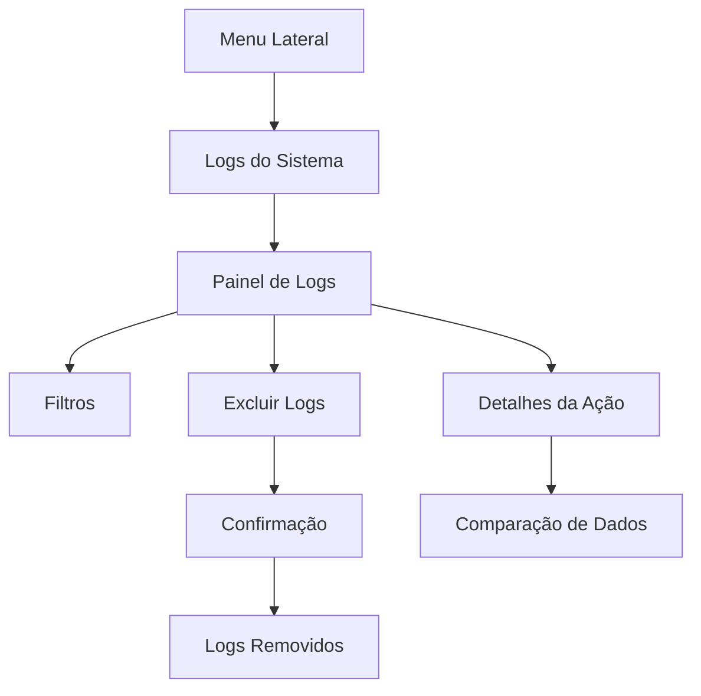

# Sistema de Logs - Requisitos do Produto

## 1. Visão Geral do Produto
Sistema completo de auditoria e monitoramento que registra todas as ações realizadas no sistema Prime Transportes, permitindo aos administradores rastrear operações de CRUD em tempo real.
- Soluciona a necessidade de transparência e controle sobre as operações do sistema, identificando quem realizou cada ação e quando.
- Destinado exclusivamente aos administradores do sistema para supervisão e auditoria das atividades.

## 2. Funcionalidades Principais

### 2.1 Papéis de Usuário
| Papel | Método de Registro | Permissões Principais |
|-------|-------------------|----------------------|
| Administrador Sistema | Email pré-definido (matteusmoreira@gmail.com, prime.inteligente@gmail.com) | Acesso completo aos logs, visualização, filtragem e exclusão |
| Usuário Comum | Registro padrão do sistema | Sem acesso à área de logs |

### 2.2 Módulo de Funcionalidades
Nossos requisitos de logs consistem nas seguintes páginas principais:
1. **Painel de Logs**: visualização em tempo real, filtros avançados, paginação otimizada.
2. **Detalhes da Ação**: informações completas da operação, dados antes/depois da alteração.
3. **Configurações de Logs**: opções de retenção, limpeza manual, configurações de performance.

### 2.3 Detalhes das Páginas
| Nome da Página | Nome do Módulo | Descrição da Funcionalidade |
|----------------|----------------|-----------------------------|
| Painel de Logs | Lista de Logs | Exibir logs em tabela paginada com filtros por data, usuário, tipo de ação e entidade. Busca em tempo real |
| Painel de Logs | Filtros Avançados | Filtrar por período específico, tipo de operação (CREATE/UPDATE/DELETE), entidade (empresas/solicitantes/motoristas/corridas) |
| Painel de Logs | Ações em Lote | Botão para excluir todos os logs com confirmação dupla. Opção de excluir logs por período |
| Detalhes da Ação | Visualização Detalhada | Mostrar dados completos da operação: usuário, timestamp, IP, dados anteriores e novos em formato JSON |
| Detalhes da Ação | Rastreamento de Mudanças | Comparação lado a lado dos dados antes e depois da alteração com destaque das diferenças |
| Configurações | Gerenciamento de Retenção | Configurar período de retenção automática dos logs, alertas de espaço em disco |

## 3. Processo Principal
**Fluxo do Administrador:**
1. Administrador acessa o menu lateral "Logs do Sistema"
2. Visualiza lista paginada de todas as ações do sistema
3. Aplica filtros para encontrar ações específicas
4. Clica em uma ação para ver detalhes completos
5. Pode excluir logs individualmente ou em lote
6. Configura políticas de retenção se necessário

**Fluxo de Registro Automático:**
1. Usuário realiza qualquer operação CRUD no sistema
2. Sistema captura automaticamente: usuário, ação, entidade, dados, timestamp, IP
3. Log é armazenado de forma assíncrona para não impactar performance
4. Administradores podem visualizar a ação imediatamente

## 4. Design da Interface do Usuário
### 4.1 Estilo de Design
- **Cores primárias**: Azul escuro (#1e40af) para cabeçalhos, cinza claro (#f8fafc) para fundo
- **Cores secundárias**: Verde (#10b981) para ações de criação, amarelo (#f59e0b) para edições, vermelho (#ef4444) para exclusões
- **Estilo de botões**: Arredondados com sombra sutil, hover com transição suave
- **Fonte**: Inter, tamanhos 14px para texto, 16px para títulos, 12px para metadados
- **Layout**: Design em cards com navegação superior fixa, sidebar retrátil
- **Ícones**: Lucide icons para consistência, ícones específicos para cada tipo de ação

### 4.2 Visão Geral do Design das Páginas
| Nome da Página | Nome do Módulo | Elementos da UI |
|----------------|----------------|----------------|
| Painel de Logs | Lista de Logs | Tabela responsiva com cores por tipo de ação, paginação inferior, loading skeleton durante carregamento |
| Painel de Logs | Filtros | Barra superior com dropdowns, date pickers, campo de busca com ícone de lupa, badges para filtros ativos |
| Painel de Logs | Ações em Lote | Botão vermelho "Excluir Todos" com ícone de lixeira, modal de confirmação com input de confirmação |
| Detalhes da Ação | Visualização | Modal ou página lateral com JSON syntax highlighting, timestamps formatados, badges de status |
| Configurações | Painel de Config | Cards organizados por categoria, switches para ativar/desativar funcionalidades, inputs numéricos para retenção |

### 4.3 Responsividade
Design desktop-first com adaptação para tablets e mobile. Em dispositivos móveis, a tabela se transforma em cards empilhados. Filtros ficam em drawer lateral. Touch-friendly com botões maiores e espaçamento adequado.